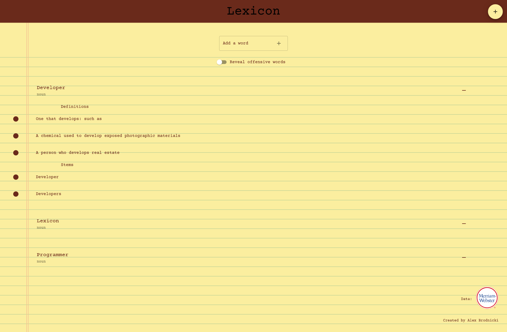

# Lexicon
Lexicon is a word list application, allowing users to save words to a personal list.

The backend data is supplied by the [Merriam-Webster Dictionary API](https://dictionaryapi.com/).

Visit the website [here](https://apbrodnicki.com/lexicon)!

___
*Lexicon was created by Alex Brodnicki.*
